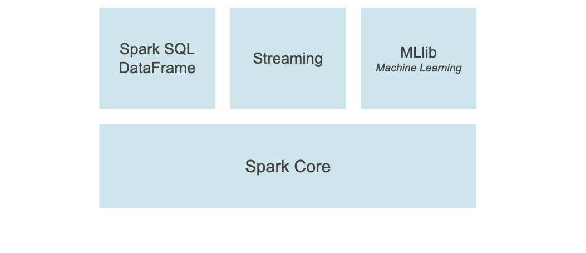

# Deploying a PySpark Application in Kubernetes

## Prerequisites

- Kubernetes cluster, minikube is used here with installation steps
- Apache Spark installation with `$SPARK_HOME` environment variable set
- Container registry, Docker is used in this example 

## Minikube

Because Kubernetes is a distributed tool, running it locally can be difficult. Enter [minikube](https://minikube.sigs.k8s.io/docs/start/), a local Kubernetes testing tool. It is available for all major operating systems and easily installable on macOS via [Homebrew](https://brew.sh/).

```
brew install minikube
```

Start the cluster, note the expanded CPU and memory parameters
```
minikube start --cpus 4 --memory 1984
```

### kubectl

Kubernetes has a cluster manager utility, [kubectl](https://kubernetes.io/docs/reference/kubectl/kubectl/) that allows an operator to run commands. `kubectl` uses an expressive API to allow users to execute commands, either using arguments or, more commonly, passing [YAML](https://yaml.org/) documents.

A simple command to get information about the running cluster. This cluster info will be used in a later step.

```
kubectl cluster-info
Kubernetes control plane is running at https://127.0.0.1:50568
KubeDNS is running at https://127.0.0.1:50568/api/v1/namespaces/kube-system/services/kube-dns:dns/proxy
```

## Apache Spark

[Apache Spark](https://spark.apache.org/) is a distributed data engineering, data science and analytics platform. It utilizes worker nodes an in-memory scheme to execute big data workloads at scale.


Spark applications start with a single context, then use a cluster manager to spawn worker nodes. These worker nodes execute a series of tasks, subdivided from the original job. When they're done they send their completed work back to the driver, before shutting down. This distributed approach executes work in parallel and allows the operator to use the cluster manager of his or her liking, be it Spark's, Apache Mesos or in this case Kubernetes.

### PySpark

[PySpark](http://spark.apache.org/docs/latest/api/python/) is a Python wrapper of the Apache Spark API, which allows data scientists and other users to create applications and utilize this platform. 



PySpark builds upon the Spark Core and adds additional capabilities, specifically Data Frames, a popular paradigm from [pandas](https://pandas.pydata.org/). In addition, there is support for streaming, making it possible to use sockets or [Apache Kafka](https://kafka.apache.org/) to feed data into applications. Lastly, machine learning is enabled via the MLib library, allowing for the creation of predictive models and other ML applications.

## Spark/PySpark on Kubernetes

Kubernetes does not supplant existing Spark clusters, but rather offers a new way to run Spark applications. Work is managed under using the same driver/executor paradigm, with Kubernetes acting as the cluster manager. Spark builds custom Docker images to do this work. Additionally, the Spark driver Pod will need elevated permissions to spawn executors in Kubernetes.

### Containerization

Spark comes with a set of [tools for building Docker images](https://spark.apache.org/docs/latest/running-on-kubernetes.html#docker-images) that will be compatible the cluster. The `docker-image-tool` is a shell script that packages. By default, the tool packages JVM-based containers. However, there is the option to supply a Dockerfile for PySpark.

The `docker-image-tool` requires the `docker` executable present, meaning that this tool will not function inside a containerized Spark instance, such as [jupyter/pyspark-notebook](https://hub.docker.com/r/jupyter/pyspark-notebook).

```
curl https://raw.githubusercontent.com/apache/spark/master/resource-managers/kubernetes/docker/src/main/dockerfiles/spark/bindings/python/Dockerfile -o Dockerfile
$SPARK_HOME/bin/docker-image-tool.sh -r docker.io/<repo_name> -t v0.0.1 -p Dockerfile build
docker push <repo_name>/spark-py:v0.0.1
```

The commands above download a PySpark Dockerfile, then run the `docker-image-tool` to build an image, specifying a registry - where the image will be stored - along with a version tag and the custom Dockerfile. Finally, push the image to a repository in Docker's public registry.

### Service Account

The Docker image will serve as a PySpark driver, meaning that it will spawn multiple Pods to execute the distributed workload. The security policies in place in Kubernetes will not allow this, so there will need to be a [ServiceAccount](https://kubernetes.io/docs/tasks/configure-pod-container/configure-service-account/) with the appropriate API permissions. The ServiceAccount is created by `kubectl create serviceaccount sa-spark`

The ServiceAccount lacks scoped permissions, so it needs a [ClusterRole and ClusterRoleBinding](https://kubernetes.io/docs/reference/access-authn-authz/rbac/). These are elements in Kubernetes' role-based access control (RBAC) API and are used to identify the resources and actions that ClusterRole can interact with.

#### ClusterRole

```yaml
kind: ClusterRole
apiVersion: rbac.authorization.k8s.io/v1
metadata:
  namespace: default
  name: cr-spark
rules:
- apiGroups: [""]
  resources: ["pods", "services", "configmaps", "persistentvolumeclaims"]
  verbs: ["create", "get", "watch", "list", "post", "delete"]
```

#### ClusterRoleBinding

```yaml
kind: ClusterRoleBinding
apiVersion: rbac.authorization.k8s.io/v1
metadata:
  name: crb-spark
subjects:
- kind: ServiceAccount
  name: sa-spark
  namespace: default
roleRef:
  kind: ClusterRole
  name: cr-spark
  apiGroup: rbac.authorization.k8s.io
```

Create these resources via `kubectl create -f cluster-role.yaml` then `kubectl create -f cluster-role-binding.yaml`

### Deployment

Deploying the sample application must originate from a Spark installation. It uses `$SPARK_HOME/bin/spark-submit` just like a regular Spark application, but connects to the Kubernetes API to deploy the cluster.

```shell
$SPARK_HOME/bin/spark-submit --master k8s://<cluster-api and port> --deploy-mode=cluster 
--name spark-pi 
--conf spark.executor.instances=5 
--conf spark.kubernetes.container.image=burgwyn/spark-py
--conf spark.kubernetes.authenticate.driver.serviceAccountName=sa-spark 
local:///opt/spark/examples/src/main/python/pi.py
```

The deployment command above will deploy the Docker image, using the ServiceAccount created above. It will spawn 5 executor instances and execute an example application, [pi.py](https://raw.githubusercontent.com/apache/spark/master/examples/src/main/python/pi.py), that is present on the base PySpark installation. Additional [configuration options](https://spark.apache.org/docs/latest/running-on-kubernetes.html#configuration) are available to run in a specific namespace, label Pods, etc.

### Results

The deployment command above will create a PySpark driver Pod which will in turn generate 5 executor Pods.

Running the command `kubectl get pods` yields

```shell
NAME                               READY   STATUS    RESTARTS   AGE
pythonpi-63b19c7d78a9f598-exec-1   1/1     Running   0          7s
pythonpi-63b19c7d78a9f598-exec-2   1/1     Running   0          6s
pythonpi-63b19c7d78a9f598-exec-3   1/1     Running   0          6s
pythonpi-63b19c7d78a9f598-exec-4   1/1     Running   0          6s
pythonpi-63b19c7d78a9f598-exec-5   0/1     Pending   0          6s
spark-pi-0768ce7d78a9e0bf-driver   1/1     Running   0          13s
```

The executor Pods will eventually complete and get destroyed, but running the command `kubectl logs -f spark-pi-0768ce7d78a9e0bf-driver` will allow us to inspect the results:

```shell
21/12/02 01:07:32 INFO TaskSchedulerImpl: Adding task set 0.0 with 2 tasks resource profile 0
21/12/02 01:07:32 INFO TaskSetManager: Starting task 0.0 in stage 0.0 (TID 0) (172.17.0.5, executor 1, partition 0, PROCESS_LOCAL, 4452 bytes) taskResourceAssignments Map()
21/12/02 01:07:32 INFO TaskSetManager: Starting task 1.0 in stage 0.0 (TID 1) (172.17.0.8, executor 4, partition 1, PROCESS_LOCAL, 4452 bytes) taskResourceAssignments Map()
21/12/02 01:07:33 INFO BlockManagerInfo: Added broadcast_0_piece0 in memory on 172.17.0.8:46385 (size: 8.3 KiB, free: 413.9 MiB)
21/12/02 01:07:33 INFO BlockManagerInfo: Added broadcast_0_piece0 in memory on 172.17.0.5:40207 (size: 8.3 KiB, free: 413.9 MiB)
21/12/02 01:07:34 INFO TaskSetManager: Finished task 1.0 in stage 0.0 (TID 1) in 2015 ms on 172.17.0.8 (executor 4) (1/2)
21/12/02 01:07:34 INFO PythonAccumulatorV2: Connected to AccumulatorServer at host: 127.0.0.1 port: 58621
21/12/02 01:07:34 INFO TaskSetManager: Finished task 0.0 in stage 0.0 (TID 0) in 2085 ms on 172.17.0.5 (executor 1) (2/2)
21/12/02 01:07:34 INFO TaskSchedulerImpl: Removed TaskSet 0.0, whose tasks have all completed, from pool 
21/12/02 01:07:34 INFO DAGScheduler: ResultStage 0 (reduce at /opt/spark/examples/src/main/python/pi.py:42) finished in 2.360 s
21/12/02 01:07:34 INFO DAGScheduler: Job 0 is finished. Cancelling potential speculative or zombie tasks for this job
21/12/02 01:07:34 INFO TaskSchedulerImpl: Killing all running tasks in stage 0: Stage finished
21/12/02 01:07:34 INFO DAGScheduler: Job 0 finished: reduce at /opt/spark/examples/src/main/python/pi.py:42, took 2.426586 s
Pi is roughly 3.137920
21/12/02 01:07:34 INFO SparkUI: Stopped Spark web UI at http://spark-pi-6f1feb7d78ae41b0-driver-svc.default.svc:4040
21/12/02 01:07:34 INFO KubernetesClusterSchedulerBackend: Shutting down all executors
```

Buried in the logs is the result `Pi is roughly 3.137920`

## Sources

[Kubernetes Docs](https://kubernetes.io/docs/)

[minikube Docs](https://minikube.sigs.k8s.io/docs/)

[Apache Spark Docs](https://spark.apache.org/docs/l)

[Apache Spark with Kubernetes](https://spark.apache.org/docs/latest/running-on-kubernetes.html)
